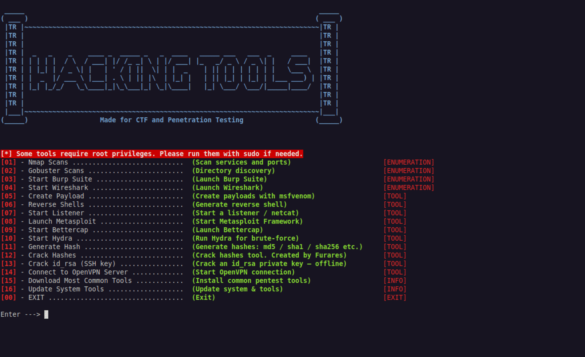

<h1 align="center">🔒 ffurares Cybersecurity Automation Tool</h1>

---

## ⚠️ Disclaimer

**Attention!** This tool is designed for **educational purposes and CTF enthusiasts**.  
It automates several common cybersecurity tasks to make learning and solving challenges easier.  

- **Use at your own risk.** The author assumes **no responsibility** for any misuse.  
- Tested **only on Kali Linux**; optimal performance is guaranteed on this platform.  
- Written in **Python and Bash Script** for automation of multiple security tools.  

Unauthorized use of this software against systems without explicit permission is **illegal**. Always stay ethical.

---

## 📖 About the Tool

ffurares Cybersecurity Automation Tool is a **multi-purpose security suite** designed for beginners, CTF players, and ethical hackers.  
It integrates multiple popular tools into a **single automated interface**, streamlining security testing on Kali Linux.

**Key Features Include:**

| Feature | Description |
|---------|-------------|
| 🔑 Hash Cracker | Brute-force or dictionary-based hash cracking |
| 🧩 Hash Generator | Generate MD5, SHA1, SHA256 hashes quickly |
| 🌐 Nmap Scanner | Network scanning and enumeration |
| 🚪 Gobuster | Directory/file brute-forcing |
| 💣 MSFVenom | Payload generation for penetration testing |
| 🕵️ Metasploit | Quick integration for exploitation tasks |
| 🔄 Reverse Shells | Pre-built reverse shell payloads |
| ⚙️ System Update | Update Kali Linux system and tools |

> All these features are **automated and integrated**, making it easy to test and learn.

---

<p align="center">
  
</p>

---

## ⚙️ Installation

Clone the repository and install dependencies:

```bash
# 1️⃣ Clone the repo
git clone https://github.com/ffurares/ctf-toolkit.git

# 2️⃣ Enter the project folder
cd ctf-toolkit

# 3️⃣ Install Python dependencies
pip install -r requirements.txt

# 4️⃣ Run the tool
python main.py
```

---

<p align="center"> <a href="https://www.youtube.com/@furares">YouTube Channel</a> &nbsp;&nbsp;|&nbsp;&nbsp; <a href="https://tryhackme.com/p/furares">TryHackMe Profile</a> </p>
